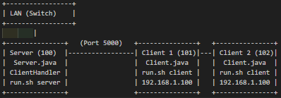

# LanChatApp

LanChatApp is a simple LAN-based chat application built in Java. It allows multiple clients to connect to a server over a local network and exchange messages in real-time. The server runs on one computer, while clients with a graphical user interface (GUI) run on other computers, all connected via the same LAN (e.g., through a switch). Clients can choose their own usernames upon startup.

# LanChatApp

---

## Table of Contents
1. [Introduction](#introduction)
2. [Foreword](#foreword)
3. [Acknowledgement](#acknowledgement)
4. [Objective](#objective)

---

## Introduction
LanChatApp is a Java-based local area network (LAN) chat application designed to facilitate real-time communication between multiple users on the same network. This project implements a client-server architecture where a central server manages message broadcasting, and clients, equipped with a graphical user interface (GUI), allow users to send and receive messages seamlessly. Developed as part of an academic assignment, LanChatApp demonstrates fundamental concepts in network programming, multithreading, and user interface design using Java’s standard libraries.

The application is structured with a clear separation of source code (`src/`), compiled binaries (`bin/`), and a script (`run.sh`) for ease of deployment across multiple machines. It serves as a practical example of how networked applications can be built and deployed in a controlled LAN environment.

---

## Foreword
This project represents an exploration into the practical application of computer networking principles and software development techniques. LanChatApp was conceived to bridge theoretical knowledge with hands-on implementation, providing a functional tool that showcases the power of Java in creating networked, interactive systems. The development process involved iterative design, testing, and refinement to ensure a user-friendly experience while meeting the technical requirements of a LAN-based chat system.

As a submission for this assignment, LanChatApp aims to illustrate not only technical proficiency but also the ability to document and present a project in a structured manner. This foreword serves as a preface to the effort and intent behind the application, setting the stage for its purpose and execution.

---

## Acknowledgement
The successful completion of LanChatApp would not have been possible without the support and resources provided by several key contributors:
- **Course Instructor**: For providing guidance on network programming concepts and assignment requirements that shaped the project’s direction.
- **Java Documentation and Community**: For offering comprehensive resources and examples that aided in implementing sockets, threads, and Swing GUI components.
- **Peers and Testers**: For assisting in testing the application across multiple computers and providing valuable feedback on usability.
- **xAI (Grok)**: For technical assistance in refining code, structuring the project, and enhancing documentation throughout the development process.

This project stands as a testament to collaborative learning and the power of shared knowledge in software development.

---

## Objective
The primary objectives of LanChatApp are as follows:
- **Demonstrate Network Communication**: Implement a client-server model using TCP sockets to enable real-time messaging over a LAN.
- **Enhance User Experience**: Develop a GUI for clients using Java Swing, allowing users to choose custom usernames and interact intuitively.
- **Ensure Simplicity and Deployability**: Create a straightforward deployment process with a single script (`run.sh`) to compile and run the application on multiple machines.
- **Apply Multithreading**: Utilize Java threads to handle concurrent client connections and message processing efficiently.
- **Document Clearly**: Provide structured documentation suitable for an assignment, highlighting the project’s purpose, design, and execution.

LanChatApp aims to meet these goals while serving as a practical learning tool for understanding networked application development.

---

## Features
- **Server**: Runs on a single machine, accepts client connections, and broadcasts messages.
- **Clients**: Feature a Swing-based GUI with a chat display area, message input field, and send button.
- **Custom Usernames**: Each client can specify their own username when starting the application.
- **LAN Communication**: Works over a local network using TCP sockets (port 5000).
- **Simple Setup**: Easy to compile and run with a provided Bash script (`run.sh`).

## Folder Structure
```
LanChatApp/
├── images/
│   └── diagram.png
├── src/
│   ├── Server.java       # Server logic
│   ├── ClientHandler.java # Handles connections
│   └── Client.java       # Client GUI
├── bin/
└── run.sh
```

## Prerequisites
- **Java Development Kit (JDK)**: Version 8 or higher installed on all machines.
    - Check with: `java -version` and `javac -version`
- **Local Network**: All computers must be on the same LAN (e.g., connected via a switch or router).
- **Operating System**: Linux, macOS, or Windows (with Bash-like environment, e.g., Git Bash, for `run.sh`).

## Setup Instructions

1. **Clone or Download**:
    - Copy the `LanChatApp` folder to each computer that will run the server or a client.

2. **Prepare the Directory**:
    - Ensure the `src/` folder contains `Server.java`, `ClientHandler.java`, and `Client.java`.
    - Create the `bin/` folder if it doesn’t exist:
    ```
    mkdir -p LanChatApp/bin
    ```
    - Place `run.sh` in the `LanChatApp/` directory.

3. **Make the Script Executable** (Linux/macOS):
- Navigate to the folder:   
```
cd LanChatApp
```
- Run:
```
chmod +x run.sh
```

## How to Run

### Step 1: Compile the Application
Compile the source files into the `bin/` folder:
```
cd LanChatApp
./run.sh compile
```
- Output: `Compiling source files...` followed by `Compilation successful`
- This creates `.class` files in `LanChatApp/bin/`.

**Note**: Re-run this command if you modify the source files.

### Step 2: Run the Server
Start the server on one computer (e.g., with IP `192.168.1.100`):
```
cd LanChatApp
./run.sh server
```
- Output: `Starting server...` followed by `Server started on port 5000`
- The server will listen for client connections on port 5000.

**Find Your Server IP**:
- Linux/macOS: `ifconfig` or `ip addr`
- Windows: `ipconfig` in Command Prompt

### Step 3: Run the Clients
Start a client on each additional computer, connecting to the server’s IP:
```
cd LanChatApp
./run.sh client <server_ip>
```
- Example: `./run.sh client 192.168.1.100`
- A dialog will prompt for a username (e.g., "Alice"). Enter a name and click OK.
- Output: A GUI window opens with "LAN Chat Client - <username>".

**Client Usage**:
- Type messages in the text field and click "Send" or press Enter.
- Messages appear in the chat area (e.g., `Alice: Hi Bob`).
- Type `/quit` and send to exit the client.

### Example Workflow
- **Computer 1 (Server, IP 192.168.1.100)**:
```
cd LanChatApp
./run.sh compile
./run.sh server
```
- **Computer 2 (Client)**:
```
cd LanChatApp
./run.sh client 192.168.1.100
```
- Enter username: "Alice"
- **Computer 3 (Client)**:
```
cd LanChatApp
./run.sh client 192.168.1.100
```


## Architecture
Below is a diagram showing how LanChatApp is deployed across three computers on a LAN:
