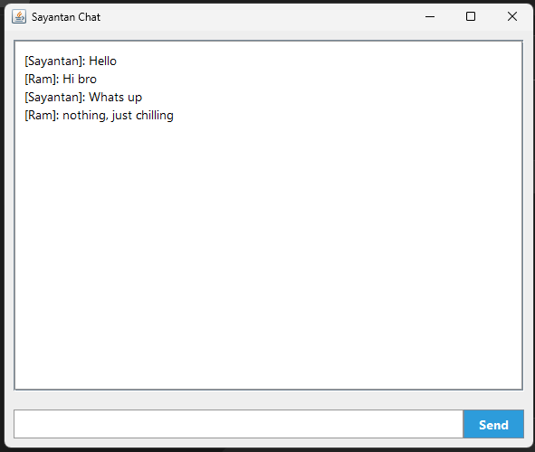
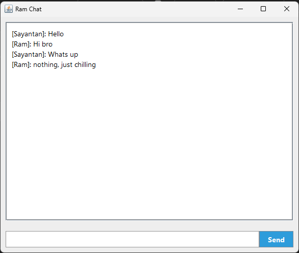
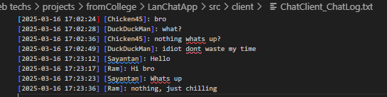

# Chat Application

## Overview
A Java-based client-server chat application allowing multiple users to communicate. Messages are dynamically attributed to chosen usernames and stored locally with timestamps.

## Features
- **Dynamic Usernames**: Prompt for username on client startup.
- **Message Logging**: Stored in `chat_log.txt` with timestamps.
- **Multi-Client Support**: Multiple users can chat via a central server.

## Clone Repo
```bash
git clone https://github.com/Sayantan-B-dev/LANChatAppJava.git

```

## Setup

### Directory Structure
```
/LanChatApp
    src/
        /server
            Server.java
            ServerThread.java
        /client
            ChatClient.java
            ChatClient2.java
    README.md
```

### Compilation
```bash
# Navigate to project root
cd /path/to/project

# Compile Server
javac server/Server.java server/ServerThread.java

# Compile Clients
javac client/ChatClient.java client/ChatClient2.java

```

### Running
```bash
# Run Server
java server.Server

# Run Clients
java client.ChatClient && java client.ChatClient2

```
### Compile and run(faster)
```bash
# Go to the server folder and run
javac Server.java ServerThread.java && java Server

# Go to the client folder and run
javac ChatClient.java && java ChatClient
# or
javac ChatClient2.java && java ChatClient2
```

### OneClick Start
```bash
# Theres three .sh files..the runServer.sh needs to start first.
# Alternatively you can use this code to start it at once.
# Make sure to cd to the root directory of the project

./runServer.sh & sleep 2 
./runChat.sh &  
./runChat2.sh &

```


## Cross-Computer Communication
Update `SERVER_ADDRESS` in `ChatClient.java` and `ChatClient2.java` with the server's IP.

```java
private static final String SERVER_ADDRESS = "192.168.x.x";
```
Ensure the server's port is accessible.

## Chat Logs
- **File**: `{Client file name}_ChatLog.txt` (created in the directory where the client is run).
- **Format**: `[YYYY-MM-DD HH:MM:SS] [Username]: Message`

### Example:
```
[2025-03-16 16:45:23] [Sayantan]: Hello!
[2025-03-16 16:45:30] [Ram]: Hi there!
```

### images





### extra:
```
$ javac -d ../bin client/*.java server/*.java //for compiling all java file in bin
jar cfe LanChatApp.jar server.Server server/*.class client/*.class //This command creates a JAR file

```


